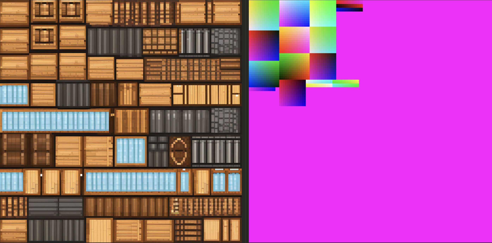

## blocksmith ai technical writeup
this is a page to go over aspects of blocksmith that i feel comfortable sharing without giving too much away about how it works. i may at some point open source it or parts of it, but for now i'm keeping it as a closed saas app.

- [why i built this](#why-i-built-this)
- [why blocksmith is different](#why-blocksmith-is-different)
- [early prototype](#early-prototype)
- [model generation overview](#model-generation-overview)
- [texturing pipeline](#texturing-pipeline)
    - [why current tools fail](#why-current-tools-fail)
    - [requirements i needed](#requirements-i-needed)
- [texturing progression](#texturing-progression)
    - [earliest version(s)](#earliest-versions)
    - [first projection attempt](#first-projection-attempt)
    - [improved per-block texturing](#improved-per-block-texturing)
    - [creation of the latest pipeline](#creation-of-the-latest-pipeline)
        - [3d-aware 2d diffusion](#3d-aware-2d-diffusion)
        - [manual multi-view with sdxl](#overview)
        - [manual multi-view with sd3.5](#overview)
        - [mv-adapter test](#overview)

### why i built this
as mentioned on the [games](./games.md) page, i built 2 hytopia games. the first one i built introduced me to an unexpected friction point: getting custom blocky style assets/models for my game. building the game was actually not that tough to do; it was harder to find assets for my game.

i found the best option at the time was meshy.ai and it's "voxel" style model generator. but it wasn't great. and i was a bit confused beween *voxel* and *blocky*. voxel style is a bunch of little cubes that make up a larger thing. blocky means using a single block per part of the model; like for a minecraft person, the head is a single block, the torso is a single block, etc. (what i actually end up building is a 3d "blocky" style model generator.) anyways, meshy seemed the closest and best option. i didn't know at the time or wasn't comfortable trying to download and host open source 3d models like hunyuan.

also, as i would find later, every single ai model, tool, or platform is designed around making high-poly, watertight meshes / 3d models. meaning it's a single monolithic mesh. they can't make true cuboid, blocky geometry. they can generate *approximate* cuboids, but it's all a single watertight mesh, the faces of cube aren't perfectly flat, the vertices aren't perfect 90-degree corners. and they're usually very high poly and relatively large files, which aren't ideal for a web-based game platform like hytopia.

also, texturing is usually baked into the overall process and does NOT support the really nice, truly pixelated look associated with blocky models / minecraft / hytopia. and every single texturing tool out there that *can* be run without a corresponding mesh generation pipeline is designed for higher resolution textures/atlases.

so, i saw this as a big gap in the market of ai and 3d. i also thought it would be very helpful to build for hytopia, because as more developers come to build on their platform, they'll need models for their games, and a tool that can generate models for them would probably incredibly useful. this is a community i really liked and wanted to support, and i saw this as a great way to do that.

### why blocksmith is different
i mentioned that (1) every state of the art ai model outputs a high poly mesh and can only *approximate* cuboid shapes, and (2) they output monolithic meshes. blocksmith was designed from the ground up to solve both of those issues.

here's an example of a model generated by meshy:

it actually looks pretty good; meshy seems state of the art. BUT, take a look at the number of faces and vertices. those are CRAZY numbers for a "blocky" model.

now take a look at a similar model from blocksmith:

by comparison, this one has 132 faces and 264 vertices.

i'm not able to download this model from meshy since it was using their latest model, but i believe it's still a monolithic, watertight mesh. whereas you can see the blocksmith model loaded into babylon is made up of nice, logically named parts and ready to be animated.

### early prototype
the earliest prototype of blocksmith created monolithic voxel style models. at the start of this whole process, i had ZERO experience in 3d, and ZERO experience with minecraft. i wasn't thinking about monolithic meshes or meshes composed of multiple parts, true cuboidal shapes, file size, faces and vertices counts, etc. those weren't even on my radar.

after lots of experimentation and brainstorming, i found a pipeline that worked:
- let a user upload a screenshot
- call trellis through the replicate.com api
- get back a 3d model
- use a script that i created by lots of trial and error with gemini that basically voxelizes the model by walking over it with some kind of marching cubes algorithm

it was super simple, but the first nugget of something interesting! [here's my x post](https://x.com/gabebusto/status/1907545086176424209) announcing the first version of it.

the coloring of the models in this version looked like some kind of airbrush technique.
. a big part of the reason is that i wasn't using nearest filtering vs lanczos, i think. but i spent a long time trying to figure out how to solve this coloring.

i also got hints from the hytopia team engineers who were more well versed in this area, and they explained to me how and why these models are not optimized. so that sent me down the rabbit hole and i continued from there.

i eventually switched to a more advanced [generative process](https://x.com/gabebusto/status/1910100441519505819) that became the foundation of what it is today.

### model generation overview
as mentioned in the section above, i eventually discovered a more robust generative process to create block style models composed of several parts, as opposed voxel style, monolithic meshes. without revealing too much, i came up with a custom process that allows an llm to output a series of mesh parts that can be composed into a full model, with semantic node names and even allowing for a hierarchy to be created.

what was interesting about this is that i think if i was more well versed in the world of 3d and ai models and how to read/apply research, i probably would have spent time trying to come up with an over-engineered solution. the fact that i was so naive may have been a kind of superpower because i tried something that would probably seem dumb to some really smart researchers, but it just happened to work.

the result of this process is that i could (1) output a truly block style model that was ~optimized (minimal geometry) and ideal for web-based games (specifically hytopia), (2) with semantic node and group names, and (3) in a relatively short amount of time and with little compute power relative to SOTA 3d ai models.

this was HUGE because it meant that i could:
- easily animate these models given that they already had node names and groups you could target
    - OR, i could use ai to animate models (which i can already do)
- have fully semantic understanding of what regions of the texture atlas belong to which parts of the model
- easily target and edit specific parts of a model by e.g. prompting ai
- create a simple export process to convert the model to a `.bbmodel` file type so people could import it into blockbench (basically it's blender but for minecraft style assets, and much simpler to use and navigate)

here are some demos from my x profile:
- [multiple prompt-to-block models](https://x.com/gabebusto/status/1912313114231533990)
- [a person wearing a hat](https://x.com/gabebusto/status/1912318527584809469)
- [an xbox style controller](https://x.com/gabebusto/status/1912321084696801419)
- [a cute lil dog](https://x.com/gabebusto/status/1912320086104301822)

the texturing at this point was still VERY basic. but i learned a whole lot about it that i'll share below.

the version of the model generation pipeline (not texturing) that's live on blocksmith today (as of September 2025) is *very* similar to this original version, but has been improved and optimized to allow ai to create more highly detailed models while saving on output tokens.

### texturing pipeline
this is where i've spent a bulk of my time over the last several months. there was a ton of stuff to learn here regarding how to generate textures for these block style models.

here's a quick screengrab from one of the old videos of the original model gen + texturing pipeline (from april 2025):

and here's the latest texturing engine from blocksmith and a zombie model it created and textured (from september 2025):

there's still lots of room for improvement, and i have a much clearer path for progression than i used to.

the current version of the texturing pipeline:
- takes a 3d block model, and either generates a texture atlas for it dynamically similar to blockbench's atlas creation process, or uses one that is provided.
    - the reason i support using one that is provided is because users can upload a bbmodel file (and soon a glb/gltf file) for texturing. and i want to preserve the choices made for unwrapping the model onto the atlas, and even preserve transparency (alpha channel = 0) and alpha testing/cutouts.
- the model is then sent to my modal.com webapp where i have a self-hosted mv-adapter model running, which uses stable diffusion xl (sdxl) to paint the model from multiple different angles
- then i take the resulting images and "project" them onto the model atlas with a custom process specific to blocky models and their pixelated textures
- then return the model and painted atlas for viewing

this was the culmination of a LOT of trial and error and dead ends that drove me crazy.

#### why current tools fail
pretty much every major 3d pipeline / tool / platform at the moment has a combined mesh generation and texturing process. and it makes sense why given how those models work. as a quick intro, these models fail for a few reasons:

- the process of texturing is usually combined with mesh generation. and since every state of the art 3d ai model can't generate true cuboid geometry, it's not possible to also use the provided texturing engine/process
- for any separate texturing processes/engines, like [hunyuan 3d 2.1 paint](https://github.com/Tencent-Hunyuan/Hunyuan3D-2.1/tree/main/hy3dpaint), or meshy.ai, their models have been trained to paint high-poly models and output high resolution atlases. they aren't able to create truly pixelated textures, nor are they able to even approximate them. they look terrible.
    - not only that, but they don't "understand" blocky models, because they're visually vague. recall that 3d block model of a person above that was created by blocksmith. that model looks *identical* from the front and the back. which side should be painted with front features? what about back features? left and right also look identical to each other. diffusion models have a hard time painting visually vague objects.
- all texturing engines or pipelines (at least that i've found) are not able to re-use the atlases you give them. the reason blocky style models from minecraft/hytopia look pixelated is because they're actually *very* small. and they usually come in sizes that are a factor of 2: 32x32, 64x64, 128x128, or 256x256. they're rarely larger than that. and when "stretched" onto the model, we use nearest filtering to ensure that each pixel is crisp and clear, otherwise we end up with more of an "airbrushed" look.

there are potentially other reasons these tools fail, but that's a good summary of the major points. not to mention that trying to make a simplified, blocky version of a real world thing look really good takes some artistic interpretation and intuition. and this is just not a style that's captured well in the training data sets for image generation models. this data is much less abundant compared to other styles.

to illustrate my point, here's an example of meshy's attempt to paint a handgun model with a pixel art style. you can also see that the atlas is 2048x2048; very high resolution! you can sort of tell if tried making it pixelated, but it's not a very good attempt. a result of the fact that it's just not designed or trained to make textures in that style, which is fair. it's not something they're focused on.
.

#### requirements i needed
you can pretty much guess what my requirements were based on everything i said above. basically what i needed is the following:
1. a separate process that could take my model and paint it
2. something that could generate decent pixel art styling
3. something that could re-use or generate a "proper" 3d block model texture atlas that will result in a pixelated look
4. something that can paint across seams, but can also apply textures that respect seams when needed.
    - (this one wasn't mentioned above, but i'll touch on why it's important)
5. *(added later)* i forgot that another BIG requirement is that my process needs to either (a) respect alpha testing / transparent pixels, and/or (b) be able to use transparency intentionally. (b) is MUCH more complicated than (a), so i settled for (a) right now.

my original texturing process was focused on generating really simple square patterns and then squeezing them or stretching them to fit a face. basically, it would create a "texture" for a shirt. one for pants. one for skin. etc. then take that square texture, and force it to fit on every face of a block that should have that texture.

a later version could generate patterns, and then intelligently crop them to fit faces without distortion, or repeat/tile the pattern. and eventually i supported per-face texturing meaning the ai could generate generic texture patterns, and they would get applied without distortions; but then for something like a face, it could generate facial expressions and add facial details.

even as recently as july i still had a texturing process that was only able to paint one cube at a time, meaning that painting a model across seams was impossible.

as i showed in the zombie image above from my latest texturing engine update, you can see that the zombie has a stripe of cloth wrapped around its head. this process allows for painting the entire model across seams, and is also smart enough / capable enough to ensure that some seams are respected. like where the blue torn shirt ends and the pants begin.

### texturing progression
i'll expand these over time, but i'll try to keep them brief for now and avoid rambling.

#### earliest versions
i mentioned briefly above that the first versions were super basic. the initial version just created solid colors, one per "material" that the model needed (like a red shirt, blue pants, light skin, etc).

after that i had an llm generate super simple patterns as a square. then each material square would be stretched or squished to fit each block face that required that texture/material.

then i eventually made it a little smarter, such that it would get cropped or tiled to avoid distortion when being applied to block faces.

and finally, i think the most "advanced" version of this would create a base color per material, then would use simplex noise to slightly shift colors of pixels so you could clearly see that it was all pixelated. then i also added the ability for the llm to generate those generic texture materials, and then also create face-specific textures. e.g., a face would the "skin" texture material as a base, but then it could paint on eyes and a mouth to create a face, and even facial expressions.

this was done over the course of several weeks i think. [here's quick demo](https://x.com/gabebusto/status/1919393335224995917) of the per-face texturing.

#### first projection attempt
the app's texturing didn't progress much for several weeks. i focused on releasing an early version of the blocksmith site and getting that up and running. but i eventually was able to create the first cool version of my texturing engine: very simple camera projection.

i experimented with a few things that led to this point. one was trying to load the model with its texture atlas, where each pixe is a unique color, almost like a unique ID. then i thought i could take a screenshot of the model, and based on the angle, i could see which large "minecraft" pixels were visible, and map them back to the original pixel on the original atlas. there was one major problem with this though: lighting in the rendered scene (along with other things) changes the color *slightly*, and just enough that it becomes nearly impossible to accurately recognize each unique color and its ID.

so i came up with another idea. i had ai write a script that could take the cubes of a model, and generate orthographic renders of front/back/left/right/top/bottom. the way it worked was like this:
- pick an orthographic angle to extract. one example would be a "front" angle, which should generate an image that looks like you're staring at the model head-on from the front.
- iterate over the model geometry
- get each cuboid's +Z / north / front face, its size, and world position
- do the math to ensure everything is centered and can fit onto 512x512 image; so make sure things are scaled and positioned relative in this image to where they would be in the real world
- then for each extracted "frontal" face, add a square that represents that face on the image, and do this from back-to-front. (we want to back to front to make sure that we faithfully reproduce an orthographic view of the model, including faces that are hidden / occluded)

the result is almost as if you took a screenshot of the model from the exact, perfect front angle. except each extracted cube face is just a black outline, and everything else is white.

so you could use this process to generate orthographic front, back, left, right, top, and bottom "views" of the model. my goal was then to use a diffusion model that supports canny edge guidance (i.e. that could paint inside the lines you give it), and see if it could paint these visually vague views using some prompt engineering techniques.

the result was that, YES - we could get some sane looking images using this technique! now, what was nice about this is that it was easy to paint my model. i could essentially reverse the process the generated the orthographic view, and i knew which regions of the image belonged to which cube faces. so i would just crop the painted image and apply it to that cube's face. there was a little more to it, but this is a simple explanation.

[here's a demo video](https://x.com/gabebusto/status/1931882012710769076) showing how my process worked for painting one side of a model (that i think was meant to be an industrial drill kind of tool). as you can see, only one side of it was painted, and the rest of the model is still gray.

however, i was using replicate at the time, and after testing with several models, the best one was pretty expensive at ~$0.05/image. so if i wanted to paint all 6 angles of the model, i would end up having to charge for > $0.30 to maintain some kind of margin. but not only that, since each process ran indepdently, they might look TOTALLY different.

so what i settled on was this:
- use my script to generate front, left, right, and top-down orthographic views
- pack them onto a 2x2 grid with some consistent format like front, top, left, right
- give that one image to this diffusion model
- take the painted version of the image
- break the grid back into their individual orthographic images
- run my process of extracting face regions and painting them onto each block face

with this process in place and working, i would only need to spend $0.05/texturing job (at least for the replicate.com api call).

now i need to solve yet *another* problem. we're only painting 4 views of the model. not to mention the fact that there might even be occluded faces from each of these views that also need to be painted. so i solved this the simplest way i could think. basically, i creating a json mapping that showed each cuboid and face of the model, and which ones had texturing, and which ones didn't. then i instructed the llm to use the prompt, along with this data, and output a full "texturing strategy" that gives me 100% coverage. its goal was to help take painted faces, and which painted faces can/should fit onto other unpainted faces, to create the most cohesive model possible.

and in many cases, this *actually* worked. this silly, hacked together process was able to do a decent job.

[here's a demo video](https://x.com/gabebusto/status/1932082333579977037) showing off the full model texturing version of this pipeline (which is actually still live on the site, btw!).

from here, i really wasn't sure what to do to continue improving it, but i was confident i'd figure it out.

#### improved per-block texturing
the above projection attempt worked well on some things; but on models that had lots of narrow parts of small details, it would fail miserably.

around the summer time (~early july 2025), i made a pretty big jump in model generation capability where blocksmith could now output more detailed models at a lower cost on the backend, and with higher accuracy.

[here's an example](https://x.com/gabebusto/status/1936624813683945904) of a grand piano model it made, including making EACH piano key a separate block. this would have been impossible to do with the original version of the model generator that i was using.

so now that i was able to generate models with much higher detail, the simple projection texturing pipeline i had would no longer work very well. so this prompted me to come up with a better per-block texturing version that could help in these cases. it would be as nice, it wouldn't be able to paint across seams, but it would be usable.

what i ended up finding out is that replicate.com has a few small and cheap models that are decent at generating tileable textures. so i came up with a very simple process that looked like this:
- an llm looks at our model's construction, and comes up with anywhere from 2-8 different "materials" to create, and it generates a prompt for each one
- we then perform an api call per material with the prompt (each one takes maybe ~3-5 seconds)
- we take all of those images, and then downsample them into smaller pixelated squares
- then we apply each of those textures to each block that needs it

the result is pretty nice for some things, and this became my go-to texturing method for lots of models.

[here's a demo video](https://x.com/gabebusto/status/1939437582749712810) showing off how well it could do. i thought it was really nice given how simplistic it was.

#### creation of the latest pipeline
the creation of the latest pipeline though was a labor of love. this was ~1+ months of research, trial and error, and dead end after dead end.

what was interesting about the process too is that i was trying to balance depth of research with speed; my ultimate goal was to build the best texturing engine i could, as quickly as i could. i didn't want to get lost in the weeds for too long and end up not delivering anything. so i optimized for speed and *some* depth of research, which really just means glossing over some papers and asking ai to help summarize things to me, and mostly focusing on research that also had published code and wasn't just theory.

for all the different experiments below, it's also worth noting that i acquired 3d block models for training data ethically. i manually went through sketchfab and downloaded models that were (a) available to download (as opposed to ripping them from the sketchfab renderer), (b) allow for commercial use, and (c) did not have an explicit "no ai use" clause/statement.

##### 3d-aware 2d diffusion
given the requirements i had above, i thought the easiest thing to do, if possible, was to try and see if i could create some kind of controlnet adapter that could help prime sdxl to paint a 2d texture atlas with some 3d awareness.

this would allow me to paint across seams, re-use a generated atlas, and even potentially apply transparency. this was doomed to fail from the start, but i wouldn't know that with certainty unless i tried.

i ended up working with ai to create a script that would take each pixel on the texture atlas, and find its position in 3d world space as `x, y, z`. the goal was then to normalize each x/y/z value to fit within the range of 0-255, and the mapping would be: x => red, y => green, z => blue. we would even generate normalized position colors for pixels that are transparent in the final texture atlas.

so what we would end up with is the original textured atlas with all the coloring already applied, and our 3d-positional atlas, where even transparent pixels in the final atlas are given a color and position. the hope is that sdxl would learn to use transparency in an artistic way.

since i mentioned transparency, it's worth noting that sdxl does NOT support RGBA; it only supports RGB. so instead, i opted to map transparency pixels where alpha = 0 to `0xff00ff` (magenta). based on all the models i'd seen up to that point, i was confident it would be a safe color to use.

i then worked with claude to create a modal script that would have a persistent web endpoint for diffusion, and that could use use controlnet canny edge guidance. once that was running successfully, it was time to run some tests. in order for this to work, we need edge guidance to ensure that sdxl knows what uv islands to focus on painting. i found that controlnet struggles to help provide edge guidance for regions that are smaller than 8 pixels in width and/or height. and this is a problem because it's possible for a block face in a model to have a 1px texture.

this makes sense why it struggles i think because sdxl's core architecture of a unet downsamples images, and it's possible that in the final downsampling steps, regions that are too small end up getting lost. so what i found was that upscaling each atlas by 8x helped controlnet in guiding sdxl's ability to paint all uv islands fully.

so this now sort of limits us. if we need to upscale each atlas by 8x, that means that if we're targeting for an input and output image from sdxl of 1024x1024, i can only use atlases that are a max of 128x128 in size. so i decided to move forwards with this anyways since it was just a test.

the training data basically consisted of / was generated by:
- iterating over each model in a directory
- filtering out any models that had (a) more than one texture atlas, and (b) whose single atlas was larger than 128x128
- extracting a single atlas from the model
- figuring out every region of the atlas that should be "active". it's possible that in the final atlas, entire faces or blocks were painted with all transparent pixels. but i want to know all the faces on the atlas that actually belong to a block in the model.
- figuring out the 3d world position of each pixel, then normalize into rgb format, and create the 3d-aware atlas
- painting any region on both the input (3d aware) and output (original painted) atlases as magenta
- upscaling each atlas by 8x, then padding it determinstically so that every image is 1024x1024
- save it in a format that we can use for training.

i also had a separate process for generating prompts for each model, where i rendered each model in a scene, took screenshots of it from multiple angles, then passed the screenshots to a multimodal model to caption it in a way that's appropriate for a diffusion model like sdxl.

now it was time to write the training script. i'll be honest and say i did not handwrite it. for most of this entire process, i worked more as a product manager guiding ai, then stepping in, fixing, and rearchitecting things when needed. but keep in mind my goal at the time was to move as fast as i could to getting a usable and improved texturing engine. so i felt comfortable between claude opus 4, gpt 5, and gemini 2.5 pro each checking each others' work to make sure we were building this training script correctly. but it did fairly well here since there's lots of examples on how to setup a lora finetune script for sdxl.

since many of the atlases are mostly empty space (now magenta), we needed to create a mask based on the 3d-aware atlas that focuses training only on uv islands / regions that are in use. this was done because the majority of the atlas is unused, so sdxl would only be learning from a very small part of the atlas being painted and the rest would just be noise.

we also wanted to make sure the model was learning *something*. so this is also where i learned about the timesteps involved with the diffusion process of denoising. we tried measuring loss using something similar from a previous lora fine tune attempt of an llm. but when adapting it to sdxl lora, it was all over the place because it wasn't checking a consistent timestep. so i learned we need to check at a consistent timestep every single time to get a better understanding of whether or not the network was learning something.

after lots of experimentation and tweaking with gpt, claude, and gemini, we were successfully able to prove that the network was learning *something*. but this wasn't going to be a viable path. the way i knew it was learning something though is the following:
- since we upscaled each atlas by 8x, that means each pixel on the original atlas turns into an 8x8 pixel grid. 8x8 pixels still looks VERY small on a 1024x1024 image. but when using my trigger token, sdxl would actually paint in 8x8 pixels (or create solid color regions that were 8x8) and able to be downsized cleanly without (much) downsampling.
- the trigger token worked, and when absent, it would likely not use the trained style.
- from an earlier training, i found that it learned something unexpected. my prompt/caption generator didn't use a diverse enough set of words in the prompt across all the models. it repeated words like "retro game asset", "8-bit pixel art", and others. and even though i was training the text encoder with a trigger token, if i used the trigger token but left out those other keywords, the it wouldn't output in the desired style. so those keywords in the prompt had a higher weight that influenced whether or not it would paint with the trained style.

below is a screenshot showing what the sdxl output was for a novel model (which was a wooden block model barrel), and the 3d-positional atlas created by my data pipeline. you'll see it still painted the entire atlas, but it somewhat stay in the lines. and this actually was an okay output for this model. but it turns out that was just luck because this model was very simple.

i realized after training that i just did NOT have enough data to really have controlnet learn to work with sdxl to condition it for 3d-aware diffusion on a 2d atlas. i thought i needed more data. so i came up with a new strategy: train controlnet + sdxl on a broad dataset of 10k+ models to learn general 3d-aware diffusion on a 2d atlas. THEN, i could use my block model atlases and fine tune on top of that.

i found [step1x-3d](https://github.com/stepfun-ai/Step1X-3D), which is a 3d ai model, a while back. i recalled in their documentation that for their texturing pipeline, they had a curated set of 30k high quality textured models from the objaverse 3d model dataset. so with claude, we came up with a script that could use the objaverse model IDs to pull the models down and download them in large batches. i think i only ended up taking ~15k models, and it ended up being ~40-50GB of data. but similar to previous data clean, i needed to make sure that we used models had atlases that were 1024x1024, and that they only had one atlas for the entire model.

i think my training script training script was pretty much ready to go without needing any major changes, so i ran a much longer fine tune job across 10k good models filtered from the the set of ~15k models downloaded.

after it was done, i tried testing it out in some way that could demonstrate whether or not it learned anything. and it failed.. hard. i realized though that some of these atlases were setup in such a way that there's almost no way for sdxl + controlnet to work together and figure out what was what. the unwrapping of the model onto the atlas was highly non-deterministic, and semantically it made no sense. it would go from one object made of one material, and blend right into another object made of completely different material. i even tried just simple tests that would show me if it learned to paint like with hints like "paint the (thing) at the top green and everything else wood brown", and it couldn't do it. not even close.

perhaps with more time i *could* find a way to make that work, but it would require more deterministic unwrapping, a deeper understanding of how controlnet influences sdxl, etc. but it was a good first shot i think.

---

more to come soon!