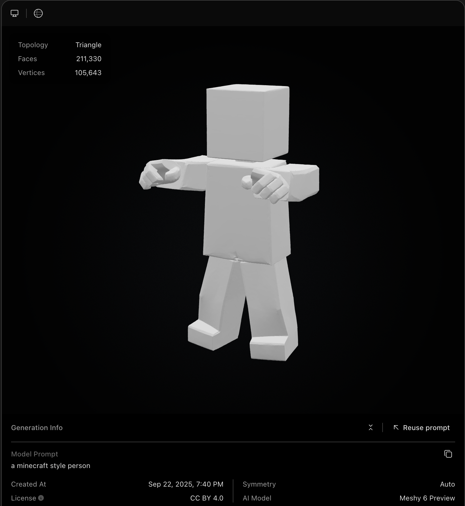
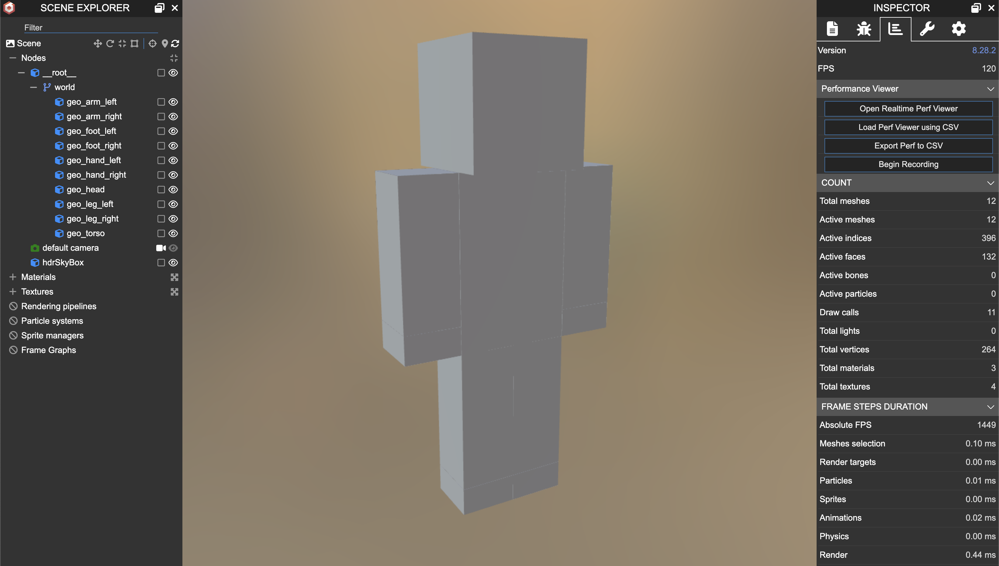
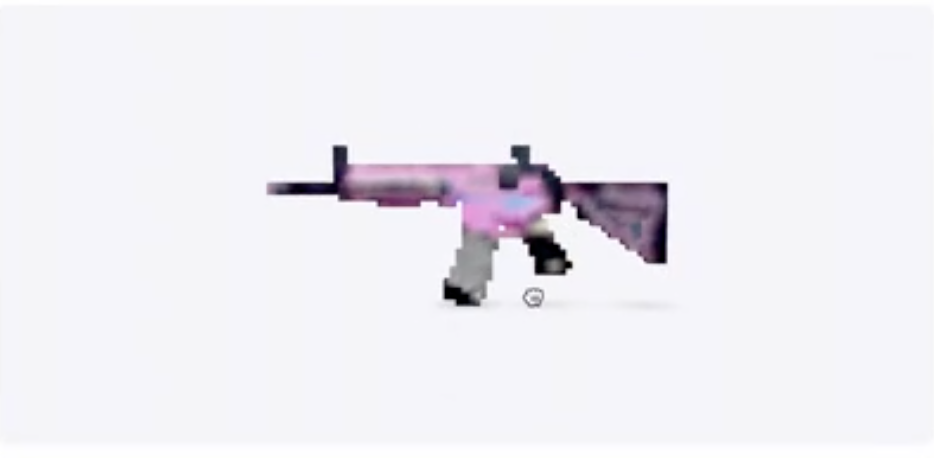
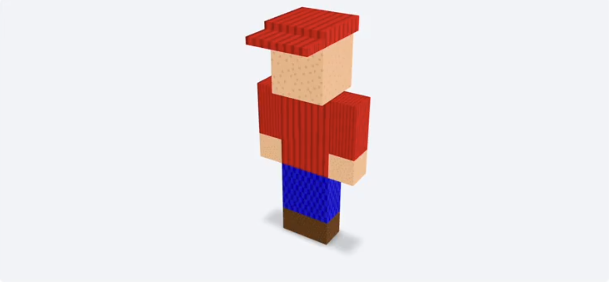
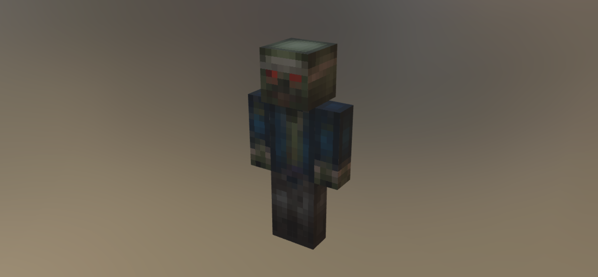
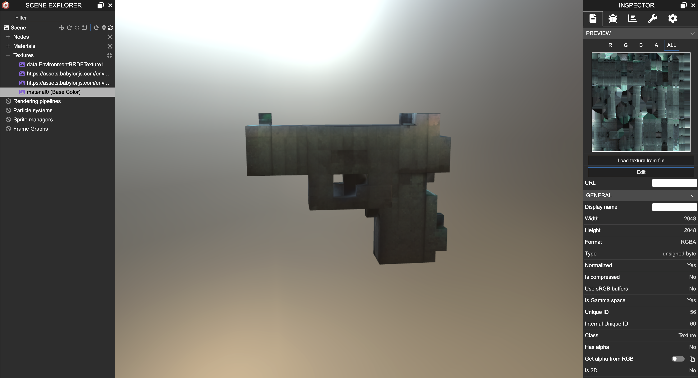

## overview

this is a page to go over aspects of blocksmith that i feel comfortable sharing without giving too much away about how it works. i may at some point open source it or parts of it, but for now i'm keeping it as a closed saas app.

- [why i built this](#why-i-built-this)
- [why blocksmith is different](#why-blocksmith-is-different)
- [early prototype](#early-prototype)
- [model generation overview](#model-generation-overview)
- [texturing pipeline](#texturing-pipeline)
    - [why current tools fail](#why-current-tools-fail)
    - [requirements i needed](#requirements-i-needed)
    - [progression and experiments](#overview)

### why i built this
as mentioned on the [games](./games.md) page, i built 2 hytopia games. the first one i built introduced me to an unexpected friction point: getting custom blocky style assets/models for my game. building the game was actually not that tough to do; it was harder to find assets for my game.

i found the best option at the time was meshy.ai and it's "voxel" style model generator. but it wasn't great. and i was a bit confused beween *voxel* and *blocky*. voxel style is a bunch of little cubes that make up a larger thing. blocky means using a single block per part of the model; like for a minecraft person, the head is a single block, the torso is a single block, etc. (what i actually end up building is a 3d "blocky" style model generator.) anyways, meshy seemed the closest and best option. i didn't know at the time or wasn't comfortable trying to download and host open source 3d models like hunyuan.

also, as i would find later, every single ai model, tool, or platform is designed around making high-poly, watertight meshes / 3d models. meaning it's a single monolithic mesh. they can't make true cuboid, blocky geometry. they can generate *approximate* cuboids, but it's all a single watertight mesh, the faces of cube aren't perfectly flat, the vertices aren't perfect 90-degree corners. and they're usually very high poly and relatively large files, which aren't ideal for a web-based game platform like hytopia.

also, texturing is usually baked into the overall process and does NOT support the really nice, truly pixelated look associated with blocky models / minecraft / hytopia. and every single texturing tool out there that *can* be run without a corresponding mesh generation pipeline is designed for higher resolution textures/atlases.

so, i saw this as a big gap in the market of ai and 3d. i also thought it would be very helpful to build for hytopia, because as more developers come to build on their platform, they'll need models for their games, and a tool that can generate models for them would probably incredibly useful. this is a community i really liked and wanted to support, and i saw this as a great way to do that.

### why blocksmith is different
i mentioned that (1) every state of the art ai model outputs a high poly mesh and can only *approximate* cuboid shapes, and (2) they output monolithic meshes. blocksmith was designed from the ground up to solve both of those issues.

here's an example of a model generated by meshy:

it actually looks pretty good; meshy seems state of the art. BUT, take a look at the number of faces and vertices. those are CRAZY numbers for a "blocky" model.

now take a look at a similar model from blocksmith:

by comparison, this one has 132 faces and 264 vertices.

i'm not able to download this model from meshy since it was using their latest model, but i believe it's still a monolithic, watertight mesh. whereas you can see the blocksmith model loaded into babylon is made up of nice, logically named parts and ready to be animated.

### early prototype
the earliest prototype of blocksmith created monolithic voxel style models. at the start of this whole process, i had ZERO experience in 3d, and ZERO experience with minecraft. i wasn't thinking about monolithic meshes or meshes composed of multiple parts, true cuboidal shapes, file size, faces and vertices counts, etc. those weren't even on my radar.

after lots of experimentation and brainstorming, i found a pipeline that worked:
- let a user upload a screenshot
- call trellis through the replicate.com api
- get back a 3d model
- use a script that i created by lots of trial and error with gemini that basically voxelizes the model by walking over it with some kind of marching cubes algorithm

it was super simple, but the first nugget of something interesting! [here's my x post](https://x.com/gabebusto/status/1907545086176424209) announcing the first version of it.

the coloring of the models in this version looked like some kind of airbrush technique.
. a big part of the reason is that i wasn't using nearest filtering vs lanczos, i think. but i spent a long time trying to figure out how to solve this coloring.

i also got hints from the hytopia team engineers who were more well versed in this area, and they explained to me how and why these models are not optimized. so that sent me down the rabbit hole and i continued from there.

i eventually switched to a more advanced [generative process](https://x.com/gabebusto/status/1910100441519505819) that became the foundation of what it is today.

### model generation overview
as mentioned in the section above, i eventually discovered a more robust generative process to create block style models composed of several parts, as opposed voxel style, monolithic meshes. without revealing too much, i came up with a custom process that allows an llm to output a series of mesh parts that can be composed into a full model, with semantic node names and even allowing for a hierarchy to be created.

what was interesting about this is that i think if i was more well versed in the world of 3d and ai models and how to read/apply research, i probably would have spent time trying to come up with an over-engineered solution. the fact that i was so naive may have been a kind of superpower because i tried something that would probably seem dumb to some really smart researchers, but it just happened to work.

the result of this process is that i could (1) output a truly block style model that was ~optimized (minimal geometry) and ideal for web-based games (specifically hytopia), (2) with semantic node and group names, and (3) in a relatively short amount of time and with little compute power relative to SOTA 3d ai models.

this was HUGE because it meant that i could:
- easily animate these models given that they already had node names and groups you could target
    - OR, i could use ai to animate models (which i can already do)
- have fully semantic understanding of what regions of the texture atlas belong to which parts of the model
- easily target and edit specific parts of a model by e.g. prompting ai
- create a simple export process to convert the model to a `.bbmodel` file type so people could import it into blockbench (basically it's blender but for minecraft style assets, and much simpler to use and navigate)

here are some demos from my x profile:
- [multiple prompt-to-block models](https://x.com/gabebusto/status/1912313114231533990)
- [a person wearing a hat](https://x.com/gabebusto/status/1912318527584809469)
- [an xbox style controller](https://x.com/gabebusto/status/1912321084696801419)
- [a cute lil dog](https://x.com/gabebusto/status/1912320086104301822)

the texturing at this point was still VERY basic. but i learned a whole lot about it that i'll share below.

the version of the model generation pipeline (not texturing) that's live on blocksmith today (as of September 2025) is *very* similar to this original version, but has been improved and optimized to allow ai to create more highly detailed models while saving on output tokens.

### texturing pipeline
this is where i've spent a bulk of my time over the last several months. there was a ton of stuff to learn here regarding how to generate textures for these block style models.

here's a quick screengrab from one of the old videos of the original model gen + texturing pipeline (from april 2025):

and here's the latest texturing engine from blocksmith and a zombie model it created and textured (from september 2025):

there's still lots of room for improvement, and i have a much clearer path for progression than i used to.

the current version of the texturing pipeline:
- takes a 3d block model, and either generates a texture atlas for it dynamically similar to blockbench's atlas creation process, or uses one that is provided.
    - the reason i support using one that is provided is because users can upload a bbmodel file (and soon a glb/gltf file) for texturing. and i want to preserve the choices made for unwrapping the model onto the atlas, and even preserve transparency (alpha channel = 0) and alpha testing/cutouts.
- the model is then sent to my modal.com webapp where i have a self-hosted mv-adapter model running, which uses stable diffusion xl (sdxl) to paint the model from multiple different angles
- then i take the resulting images and "project" them onto the model atlas with a custom process specific to blocky models and their pixelated textures
- then return the model and painted atlas for viewing

this was the culmination of a LOT of trial and error and dead ends that drove me crazy.

#### why current tools fail
pretty much every major 3d pipeline / tool / platform at the moment has a combined mesh generation and texturing process. and it makes sense why given how those models work. as a quick intro, these models fail for a few reasons:

- the process of texturing is usually combined with mesh generation. and since every state of the art 3d ai model can't generate true cuboid geometry, it's not possible to also use the provided texturing engine/process
- for any separate texturing processes/engines, like [hunyuan 3d 2.1 paint](https://github.com/Tencent-Hunyuan/Hunyuan3D-2.1/tree/main/hy3dpaint), or meshy.ai, their models have been trained to paint high-poly models and output high resolution atlases. they aren't able to create truly pixelated textures, nor are they able to even approximate them. they look terrible.
    - not only that, but they don't "understand" blocky models, because they're visually vague. recall that 3d block model of a person above that was created by blocksmith. that model looks *identical* from the front and the back. which side should be painted with front features? what about back features? left and right also look identical to each other. diffusion models have a hard time painting visually vague objects.
- all texturing engines or pipelines (at least that i've found) are not able to re-use the atlases you give them. the reason blocky style models from minecraft/hytopia look pixelated is because they're actually *very* small. and they usually come in sizes that are a factor of 2: 32x32, 64x64, 128x128, or 256x256. they're rarely larger than that. and when "stretched" onto the model, we use nearest filtering to ensure that each pixel is crisp and clear, otherwise we end up with more of an "airbrushed" look.

there are potentially other reasons these tools fail, but that's a good summary of the major points. not to mention that trying to make a simplified, blocky version of a real world thing look really good takes some artistic interpretation and intuition. and this is just not a style that's captured well in the training data sets for image generation models. this data is much less abundant compared to other styles.

to illustrate my point, here's an example of meshy's attempt to paint a handgun model with a pixel art style. you can also see that the atlas is 2048x2048; very high resolution! you can sort of tell if tried making it pixelated, but it's not a very good attempt. a result of the fact that it's just not designed or trained to make textures in that style, which is fair. it's not something they're focused on.
.

#### requirements i needed
you can pretty much guess what my requirements were based on everything i said above. basically what i needed is the following:
1. a separate process that could take my model and paint it
2. something that could generate decent pixel art styling
3. something that could re-use or generate a "proper" 3d block model texture atlas that will result in a pixelated look
4. something that can paint across seams, but can also apply textures that respect seams when needed.
    - (this one wasn't mentioned above, but i'll touch on why it's important)

my original texturing process was focused on generating really simple square patterns and then squeezing them or stretching them to fit a face. basically, it would create a "texture" for a shirt. one for pants. one for skin. etc. then take that square texture, and force it to fit on every face of a block that should have that texture.

a later version could generate patterns, and then intelligently crop them to fit faces without distortion, or repeat/tile the pattern. and eventually i supported per-face texturing meaning the ai could generate generic texture patterns, and they would get applied without distortions; but then for something like a face, it could generate facial expressions and add facial details.

even as recently as july i still had a texturing process that was only able to paint one cube at a time, meaning that painting a model across seams was impossible.

as i showed in the zombie image above from my latest texturing engine update, you can see that the zombie has a stripe of cloth wrapped around its head. this process allows for painting the entire model across seams, and is also smart enough / capable enough to ensure that some seams are respected. like where the blue torn shirt ends and the pants begin.

#### progression and experiments

this will end up being the bulk of this page. coming soon.