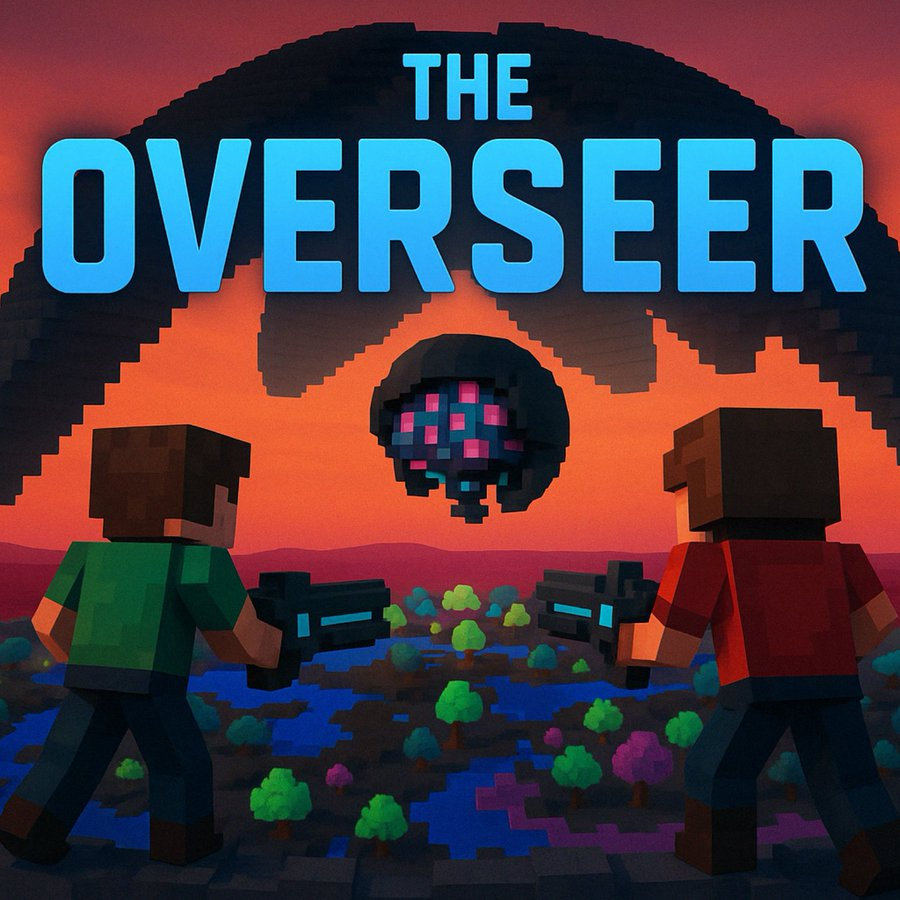
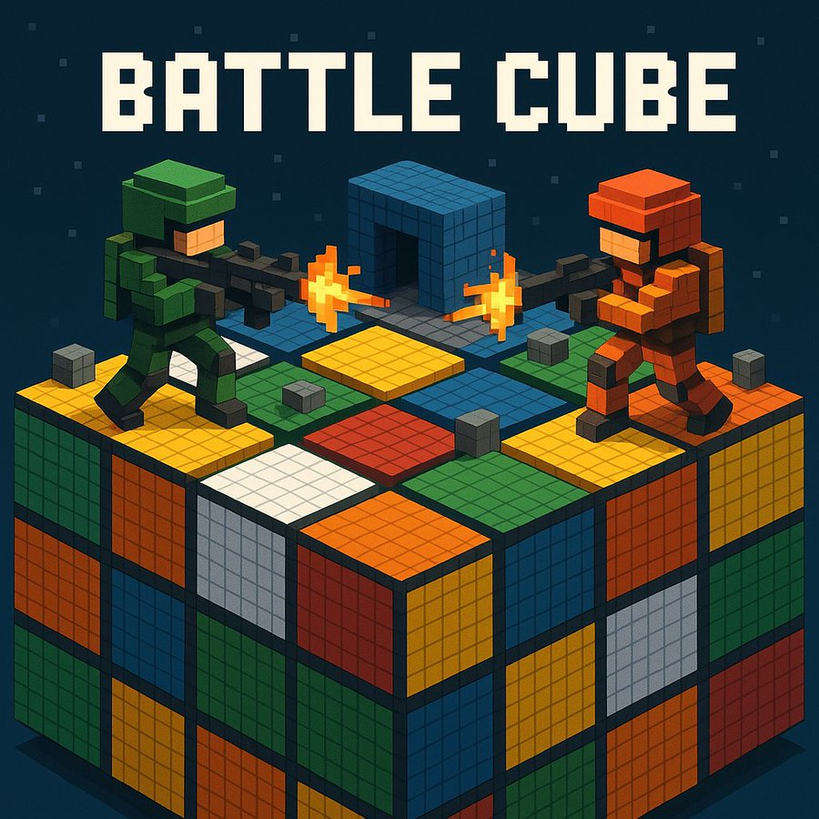

## games i created

these were all relatively simple games, but still a great learning experience. at some point i think would be very interesting to build my own physics and game engine just to learn. but now is not that time.

- [hytopia web-based games](#a-couple-of-web-based-hytopia-games)
    - [the overseer](#the-overseer)
    - [battle cube](#battle-cube)
- [mobile games](#mobile-games)
    - [brick break](#brick-break)
    - [hovr bird](#hovr-bird)

### a couple of web-based hytopia games

i built two games using hytopia's sdk. these were both for game building competitions, but also made for fun side projects.

#### the overseer

the first one was called The Overseer. it's a single or multi-player co-op game where you're stuck in a damaged biodome with a rogue ai operator in charge of protecting the biodome. it sees you and other players as hostiles and tries to eliminate you using its biodome control system. attacks included things like increasing and decreasing temperatures to hurt you, a uv light that targets one player and follows them around (if you get stuck or stop moving, it can do some real damage), ground electrification, and so on.

i designed it such that the game would collect global game state including players remaining, player health, current biodome temperature, and so on, feed it to an llm, and have the llm use structured output to determine what actions to take next, and what taunts (if any) to communicate to the players. i used a tts model hosted on replicate.com to convert the text the speech, and then had a script that would apply randomized distortions to the voice depending on the ai overseer's remaining health. lower health meant a higher chance of significant corruption to the audio file; higher health meant mostly stable audio file. the inspiration for all of this was glados from the portal games, as she becomes increasingly paranoid and glitchy.

the tts feature was a little tricky to get working. hytopia game models, audio, etc are all contained in your game folder in a directory named `assets`. so i had python api service running on the same machine as my hytopia game code, and the api service was the one responsible for making the api calls to the llm and replicate.com for tts. it would then get back the tts file, run the corruption script, take the output audio file, and shove it into the assets folder where it needed to be, along with a unique file name. after the audio file played, it was deleted to avoid cluttering up the folder.

[overseer game demo](https://x.com/gabebusto/status/1912167058596372716)

#### battle cube

i also created a fun little first person shooter game called battle cube. it was a simple deathmatch style game fought on what looks like a giant rubiks cube with weird structures on the surface for more interesting gameplay.

there wasn't much special about this, but there were some fun details.

i added a rubber chicken gun (did NOT fit the blocky aestheic; remember, this is why i created blocksmith in the first place!) that would launch little chicken grenades at people. there was also no special effects at the time in the sdk so i had to get creative in making what looks like an explosion. which was basically by creating a 3d model of some kind of comic explosion look, and creating several at the ~same time at increasing sizes and having them quickly fade in and out. it also made a rubber chicken noise 😂

[chicken gun demo](https://x.com/gabebusto/status/1907252002712682868)

i also added a fun item to the game: the birthday cake 🎂 whoever consumed this item was safe. but the game would then pick the current player with the best kill-to-death ratio, dim all the lights, shine a bright spot light on them that follows them around, and plays an obnoxious happy birthday song on repeat until they are killed.

[birthday cake demo](https://x.com/gabebusto/status/1903892581869617594)

and here's a look at the final map and game:

[battle cube demo](https://x.com/gabebusto/status/1907040018863992878)

### mobile games
while working at raytheon, i built 2 mobiles games:
- brick break
- hovr bird

#### brick break
[Brick Break](https://apps.apple.com/us/app/brick-break/id1445634396)

this was the first real thing i built and shared with the world. i built it on nights and weekends, with no ios experience whatsoever. i built it using Swift and SpriteKit. it was meant to be a copy of well known game at the time called Ballz built by ketchapp; that studio released so many big hit games. so i figured i'd just copy instead of trying to come up with something fresh.

my true motivation was that i learned how the flappy bird creator made a ton of money (i think $50k/day at its peak from ads!) and i wanted to try making a game to see if i could make money from it. i ended up finding out though that i just really enjoyed the process of building *something* and sharing it with the world. it was one of the coolest feelings. everything i had worked on up to that point in my life was something that had to be kept secret and could never be shared. but this was something that i *could* share.

it became a passion project and something that i just did for fun. i found myself sitting at my desk late at night after dinner building, first thing on weekend mornings i'd be at my desk building, on vacation when out of time i'd find time to sit down and build.

it was an addictive loop: think of a cool feature, build that feature, load the game onto my phone, and play. if there was a bug, i could immediately troubleshoot and fix it. and my girlfriend at the time (now wife) also loved time-waster type games like this when riding the metro, so i'd load it onto both our phones. anytime she found a bug, she'd let me know and i'd fix it. it was super fun.

i ended up creating an llc for it, even though that was completely unnecessary. but at the time, i was trying to build the next addictive mobile game that would go viral like flappy bird. so i thought i needed an llc to protect myself. i even registered it in new mexico with a registered agent because they could protect your name and personal info. i wasn't taking chances of whackos finding me and my home address when i was making millions - no way.

in the end, it got mostly 5 star reviews (several from complete strangers!) and a one star review i think from a hater. it wasn't even constructive. you can still find it in the App Store, download, and play it. my wife and i actually still do play it when traveling!

#### hovr bird
[Hovr Bird](https://apkpure.com/hovr-bird/xyz.ashgames.hovrbird)

this game was meant to be a flappy bird knockoff. this would come back to bite me in the end.

but i started out using spritekit on ios because i already knew how to build with it. but there was some weird shaking of the screen when tapping, and i spent weeks trying to troubleshoot what was going on. it finally hit me when reading a comment online that maybe apple's spritekit wasn't a perfect piece of software because it, on its own, doesn't bring in money. so it might not get the tlc it deserves to keep it nice and polished.

something like unity however *should* be more polished. so i decided to jump ship from ios native to unity for cross platform development so i could launch on ios *and* android, plus take advantage of a better game engine that has more of an incentive to really keep it polished and working well.

i spent some time learning how to use C# and the patterns needed for creating a mobile game on unity. i found it just as addicting as building on ios once i got up to speed because it was that same addictive building loop: build a new feature or level, load it onto my phone, actually get to play the game, then move on to the next feature or bug fix.

this game had the same mechanics as flappy bird, but i created several different levels. levels had themes: like a sky theme, a beach theme, and i think i had a third theme but i forget what it was. each theme was broken into 5 levels, and the first was always the easiest with the least amount of obstacles, and each successive level had more and more obstacles to avoid that fit in with the theme.

i didn't make a ton of money from brick break using ads, so i decided to try and add one-time purchases using in-app purchasing apis from google and apple.

one interesting result from this game is that i learned to think a little higher level in my design so that e.g. i could use the same overall design or architecture for payments, but with different in-app purchasing systems. so i had to learn how both of them worked, come up with an interface that would suit both, and then build each implementation separately.

i did a similar thing to make building new levels easily and create a sort of factory / config that would make it easier to add new level themes and obstacles to the game.

unfortunately, after ~2 months of building, apple flat out rejected it saying they had too many flappy bird clones. but i think it just depends on the reviewer you get, and how good or bad of a day they're having.

the android version *did* make it to market though, although this wasn't the latest version i had in development. i had 2 other sets of themed levels that i guess were never released.