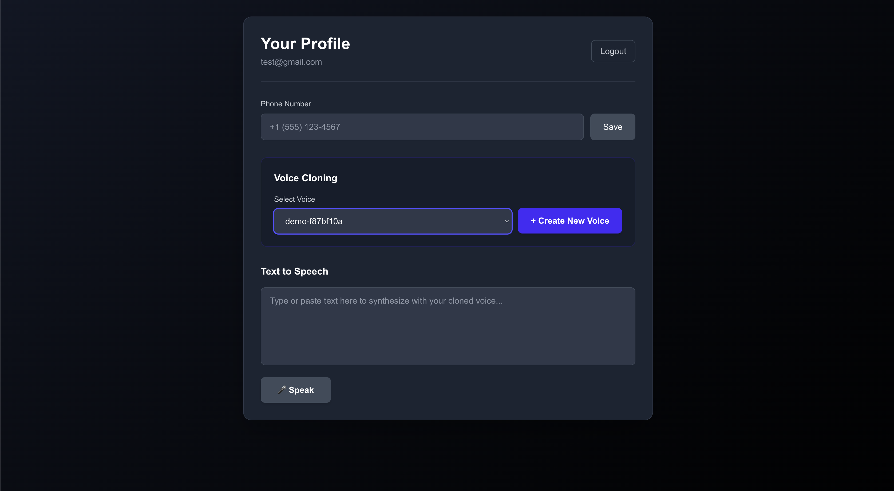
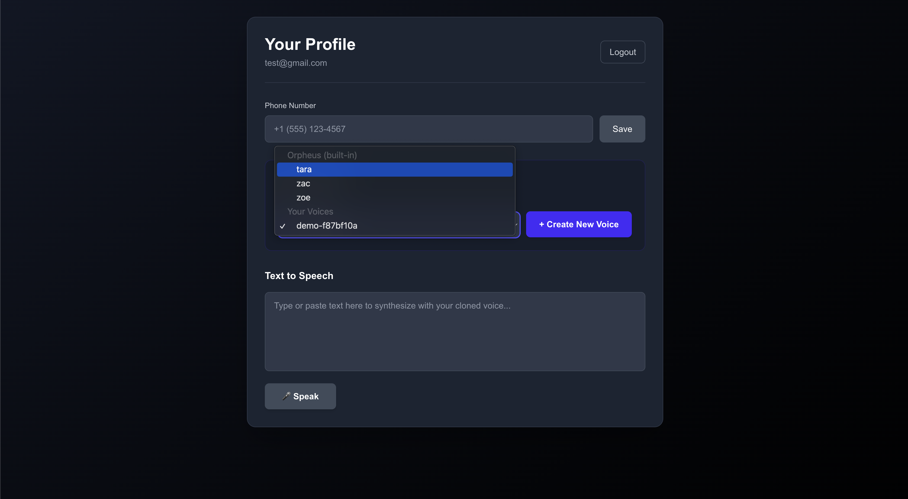

# speech models

([Repo can be found here](https://github.com/gbusto/voice-clone-ivr))

> 💡 the setup instructions may be missing steps, but should be mostly complete. if you want to try it out and run into issues, you can create an Issue or find [me on X](https://x.com/gabebusto)

for reasons i won't explain at the moment, i wanted to play around with speech models and voice cloning via IVR - interactive voice response. i decided to use twilio since it has easy self-serve signup (and they gave me some free credits to test things out).

i first started this because i had this idea of wanting to create a demo of cloning your voice over the phone. right now, i'm pretty sure all voice cloning services are done via a webapp or desktop app. this means you need to give your browser or a desktop app the right permissions, and you need to put on headphones or get close to your mic. it's not a huge pain, but i thought there was a better way.

your phone has a mic and it's likely always active (hello, NSA 👋). it's obviously active when you're on a call. so i thought it'd be neat to create a quick demo that let's you clone your voice via phone. this could be an alternative to app-based cloning that requires permission, and seems like a path with - in my opinion - less friction. it goes like this:
- in an app, click "Clone my voice"
- enter your phone number
- a call comes in and says something like "Ready to clone your voice? Press 1 to start recording, then press 1 again to end the recording. Speak for ~20-30 seconds"
- you press the number 1, wait for the beep, then start talking. you can hold the phone up to your ear, or use bluetooth headphones, or even have the phone on speaker
- once the call is done, your backend grabs the audio from twilio
- send the audio to the elevenlabs cloning endpoint
- and <30 seconds later it's all done!

all the user has to do is type in their number, answer the phone, and talk. no dealing with permissions in an app, restarting the app after granting it mic access, etc.

and it actually works pretty well! this demo shows a simple NextJS frontend app with a Python/FastAPI backend. start the app, visit `http://localhost:3000` then either sign up or sign in with your creds. you'll be taken to this page:

this shows my already-recorded voice in the dropdown. but you enter your phone number (with a country code) and Save it. then click `Create New Voice`, and you'll receive a phone call.

you of course need to first create a twilio account, and some other setup stuff which should be in the repo's README. so please make sure you read that. if you try to use this and have issues, please reach out; you can create an issue, or find [me on X](https://x.com/gabebusto).

you'll receive a phone call, you press #1, speak into the phone, then the backend will handle the rest and update the frontend. after that, you can select your new cloned voice for TTS and see how it sounds.

it's worth noting that i don't have any audio cleaning code on the backend to analyze the quality of the recording and try to remove background noise and clarify it. but i don't think this would be too difficult to do.

## orpheus speech model
i had greater ambitions for this demo initially, and the real end goal was to try and create a high quality clone of your voice using a self hosted speech model on Modal.com. the problem is that in order to create a higher quality clone, you generally need 2-5 minutes of audio (from what i've heard). this is a lot to ask a user over the phone to spend 5 minutes talking to nobody.

one clever way to handle this though is to maybe have the user chat with a guided voice agent that guides them through different speech tasks to speak faster, slower, louder, quieter, with more or less emotion, etc. but i didn't want to go through with all of that.

there is a `modal` folder though in the repo if you want to deploy the [orpheus model](https://huggingface.co/canopylabs/orpheus-3b-0.1-ft). in the app dropdown, you'll see some of the default voices that come with orpheus.

if you select one of those voices and use the TTS box below, it will take ~1 minute to generate the audio due to cold starting the model each time on modal. you could keep the container warm if you're using a cheaper GPU, but since this is a demo and i ran tests infrequently, keeping the container warm seemed like a waste of money. i'd rather just pay for cold start time.

## LFM2 - new speech model
you'll notice in the repo there is a modal script for a speech [model named LFM2](https://huggingface.co/LiquidAI/LFM2-350M). this is a really neat new model that can actually do *speech-to-speech*. as far as i know, the "old" way of doing things was:
- take user speech and convert it to text (likely server-side)
- feed the text to an llm with conversation history
- as the llm streams out tokens, feed them to a TTS model and stream back the audio. may need to buffer by sentence, not sure
- client receives audio as it's streamed and plays it for the user

but now with LFM2, it looks like this:
- stream user speech to server
- feed it directly to the LFM2 model (along with previous chat history)
- LFM2 streams out interleaved text and audio tokens
- stream back both streams to the client and display text + play audio

so instead of using multiple models (STT, LLM, TTS), you literally just use LFM2. the downside is that it seems a bit more difficult to make this performant and realtime. and it's not a very smart model. i haven't spent a ton of time with it in trying to improve performance, but we added some metrics to try and diagnose where bottlenecks were (the interleaved loop, how fast text tokens were stream, how many were streamed before switching to audio, how many audio tokens were streamed, how fast each stream was sent back to the client, when the client actually received each streamed chunk, when the client actually has enough audio buffered to play, etc).

there's also a voice client to test this all out via command line.

the modal script uses an H100, so just be sure to manually stop the app once you're done because we keep the FastAPI modal app live when running the voice client.

really neat model though and looking forward to seeing what else [Liquid AI](https://www.liquid.ai/) releases in the future.

in my opinion, i think using dedicated STT, LLM, and TTS models is still the way to go. there are realtime STT APIs (like AssemblyAI's API), bigger LLMs are smarter and better at back-and-forth conversation, and TTS models are getting super small and super fast. so while LMF2 has ~fewer moving parts, i think it's still subpar when it comes to facilitating realtime, sane conversations.