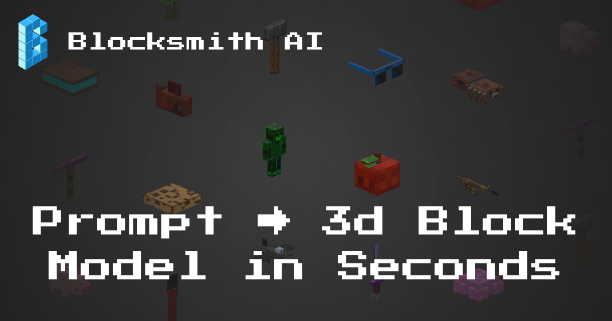

## overview

most of these were full end-to-end apps that were deployed, had a signup flow, and database. some were just prototypes or for fun.

- [blocksmith ai](#blocksmith-ai---online-at-blocksmithaicom)
- [ai tutor](#ai-tutor-duolingo-like-web-app---offline)
- [research paper assistant](#research-paper-assistant-prototype)
- [other random ai apps](#other-random-ai-apps)
- [nft art marketplace](#an-nft-art-marketplace-full-web-app--android-tv-app--custom-smart-contracts)

### blocksmith ai - online at blocksmithai.com

🚧 *[blocksmith ai technical writeup  (WIP)](./blocksmithai.md)* 🚧

this is the "real" ai product i mentioned in my home page intro. by real, i mean it's more than just a gpt wrapper. it's a webapp that let's you create 3d block models (think minecraft) from a prompt. it also has the ability to texture them using the classic pixel art look that minecraft is known for.

you can actually visit the site and use the tool for free at [blocksmithai.com](https://blocksmithai.com). i created it to address major friction in the development of games on the hytopia game platform (think minecraft-meets-roblox), and currently have a few paying customers (including a team account using it to create models for their games). i've also had probably close to, if not more than, 100 free users over the last several months without putting any real effort into marketing because i was focused on building. i believe marketing gets easier once you know your product is amazing, and it's *almost* there.

i'll provide a technical writeup sharing some of the details of the application, experiments i ran, dead ends i ran into, etc. but going into this, i had zero experience in 3d, and zero experience with minecraft (aside from knowing that it existed, and that everything is blocky and pixelated).

but no other ai model, platform, or tool replicates what blocksmith can do. a big part of the reason is that the entire 3d ai space is focused on high-poly, watertight mesh generation. nothing out there can create a model made of multiple, perfect cuboidal parts, and then generate a pixelated texture for it. my model generation pipeline uses no outside dependencies like blockbench or blender to build the model, and uses [mv-adapter](https://github.com/huanngzh/MV-Adapter) (hosted on [modal](https://modal.com)) for multi-view consistent diffusion, then a custom backprojection pipeline to paint the mesh's original atlas and giving it that nice pixelated look and style.

i have the ability to animate these models using ai as well, but haven't integrated it into the site yet because the ux need some changes before it makes sense to add that in.

[latest texturing engine showcase](https://x.com/gabebusto/status/1966232224560279842)

### ai tutor (duolingo-like web app) - offline

this was a webapp with a very simple interface. it was focused on helping people learn more about ai in byte-sized chunks (yes, pun intended), but there's no reason it couldn't have been opened up to learning anything about anything given the way it was developed.

you would sign up, have a short onboarding that shares your motivation and preferred learning style and tutor personality, and that's it. then enter a topic you want to learn about, and i would use ai to quickly research the topic to come up with high level modules + a description of why that was useful.

the user could click on a module, and ai would would then dive in and quickly research that module using the contextual description to create 5-10 screen-sized small lessons. lessons were just text, but included citations and sources.

at the end of the module, there are questions based on the lessons to test your knowledge. ai would dynamically generate these questions, and they could be a simple fill in the blank, multiple choice, or short answer. ai would grade your response and give you feedback if you got it wrong to help give you some feedback.

[app onboarding flow demo](https://x.com/gabebusto/status/1898053743746187356)

[module, lesson, and quiz demo](https://x.com/gabebusto/status/1899470710122205311)

### research paper assistant (prototype)

this was a prototype that i never launched publicly or posted about, but it led to the ai tutor app above. it came pre-loaded with ai research papers, and you could open them up onto an infinite canvas. you could move and re-arrange the pages however you wanted.

on any given pdf page, you could click and drag to create a highlight box, then right click to either create a sticky note for that region, or start a chat with ai about that region. it would clip the image behind the highlight box, and send it to an llm along with context about what paper you're reading and what page you're on.

each paper that was "pre-loaded" was processed using [unstructured.io's open source chunking code](https://github.com/Unstructured-IO/unstructured), and [weaviate](https://github.com/weaviate/weaviate) as a rag database to store the chunks. i used litellm on the server as the tool using assistant/agent, and it could:
- search the internet using google's search api
- query the weaviate rag database using several different methods (search across papers, for through a single paper, retrieve page contents, etc)

i planned to continue developing it, but thought the ai tutor path would make a better app. most people who read research papers may already use something like notebooklm, or not really feel the need to take notes or ask ai questions. folks who are newer to ai may not want to wade through research papers. so i made the shift to the ai tutor app.

### other random ai apps

- (a prototype) created a separate tool that could process a video (capture frames, align them with audio transcription from AssemblyAI, and batch process them), understand it, and then answer questions.

- (full web app) developed an app that uses ai to analyze the cohesiveness of a youtube video’s thumbnail, title, and first 30 seconds of audio. it used the youtube api to pull the transcript, title, and thumbnail, and litellm to have an llm generate scores and curate feedback.

- (full web app) built a landing page analysis tool that could dynamically load, screenshot, and parse page text to give users actionable feedback to improve conversions and reduce bounce rate.

### an nft art marketplace (full web app + android tv app + custom smart contracts)

in march/april of 2020 covid hit and locked everything down. i was living in arlington, va at the time working at raytheon doing computer security research. my job was in-person, so it was a really weird time, but my (now) wife and i wanted to get out of the city and dc area and move to raleigh. and i decided to leave my job at raytheon and to build an nft art marketplace, where my cousin (who was an artist) would be the business guy and use his network in the art world to help, and i would be the engineer that builds the app.

i had no experience at the time with aws, production apps and workflows, blockchain; nothing. i thought it was either going to be the dumbest thing i ever did, or one of the best. turns out it was somewhere in the middle, but leaning more towards the "good" side.

i quickly learned about ethereum smart contracts and how to build apps, picked django and python as our backend, aws as our infra for the app, and infura as our infra for blockchain. i learned pretty early on that nfts were basically pointless and couldn't for the life of me wrap my head around why people paid so much for them. they were paying for a piece of json data on a blockchain that referenced an image off-chain that could go offline at any time. and not only that, anybody could snag the jpeg you bought.

so my cousin and i decided to make our app different, starting with ownership. blockchain really limits how big of a file you can store on chain; crypto punks (i think) was able to do this though because they had small, pixelated images. but, my cousin knew that digital artists' original files were >= ~100MB so they could be printed very large if needed. so here was our pitch and what we though differentiated us:

- artists would upload their high-res images and *these* would be the protected assets. our website would load very low-res versions of the images
- collectors would basically buy an nft which allowed them to view and display the high-res image on their desktop as a background, their phone, or their tv. but they still technically didn't "own" the original file; i.e. they could not (yet) request a print of it, or get access to the raw file
- we learned how much of a pain it was to buy any kind of crypto (ethereum, bitcoin, etc). so we were the first marketplace to let buyers pay with a credit card through stripe. it was early enough that stripe and credit card companies didn't have a strong stance, so we were able to slip through the cracks. also, we didn't have any kind of crazy high volume so it likely wouldn't have been flagged
- collectors, after buying an nft, could then go into their dashboard and create custom playlists of their artwork, download our android tv app, and then view their high-res images on there. the goal was to also provide some way to let them show the image on their desktop, mobile device, and other places. but we didn't get that far, and that would essentially break our "security" model to protect access to the raw, higher res images
- this was also around the time when gas fees on ethereum were getting out of control. and to mint an nft would cost an artist like $10-$50 per nft! so i came up with a custom erc-1155 smart contract that would basically "lazy mint" the nft, and the buyer would pay the minting gas fee - not the artist. explained more later.

while this was technically fun an interesting to work on given the constraints, it was not a great business move.
- buyers were crypto bros who were flush with crypto at the time. they already had it, or were comfortable buying more. they wanted to spend their crypto; not pay with a card. we were early on the credit card thing (said another way: we were *wrong*)
- buyers didn't care about the high resolution artwork, or displaying it on their tv. they just wanted to buy the nft for reputation points, fun, or to then trade and try to make a quick buck (i.e. gamble)
- most artists didn't actually care about people being able to download a screenshot of their artwork. they would only release a 1024x1024 or 2048x2048 max sized image anyways, and the good artists were getting paid so much money they didn't care about "protecting" their artwork (this was before diffusion ai models were big though!)

cool technical things i built to enable all of this:
- the custom erc-1155 smart contract. this lets you batch transactions as opposed to erc-721 which could only process one transaction at a time. to enable lazy minting, an artist could specify ahead of time how many pieces of a certain type of artwork could be minted. this was just one, small transaction. after that, a buyer could buy a new nft, the new nft would be minted with the artist listed as the creator in the contract for provenance, and the new owner would be the buyer.
- custom payments integration with stripe that would give the user a timed checkout with a window where the amount they paid in usd would be converted from eth based on the current price, plus some extra percentage to ensure the transaction was processed quickly, and if we ended using less than what they paid, they would be refunded the difference.
- a custom nft auction contract. fortunately, several major nft auctions had gone awry and the security community wrote out detailed blog posts on how to create the safest possible auction contract. i ended up creating a really subtle bug in our auction contract, which was supposed to run for 24 hours, but would only run for just over 18 hours. i don't remember the exact details, but i did a lazy comparison to determine if it was time to end the contract, and since i didn't use an explicit variable in the comparison, the ints were being cast down to 2 bytes, so an auction could at most run for 0xffff / 65,535 seconds which translates to ~18.20 hours.
- since we wanted to protect the high res images, and we wanted buyers to be able to view the images on their tv (via an android tv app), i needed to solve a few different problems:
    - first, the original sized files are all pretty large; most of them over 100MB. the hardware on android tvs was **not** meant to store much data. i think most only had like 8GB of onboard storage. and obviously very little RAM. so, we can't store these massive images on there, and likely can't cache many images, so we would also need to be downloading massive images every time which would take a while. so i ended up creating a lambda process on image upload that would quickly create multiple, resized smaller versions of the image: one for the website at 768x768 max, 1024x1024, and 2048x2048 max (it would maintain aspect ratio). then we could store multiple images and/or cache them.
    - second, it was highly unlikely, but someone could feasibly grab the images off the device if we stored them without encryption. so i created a simple drm-like feature that would encrypt each image with a unique key the first it was pulled, and it would only decrypt in memory. when the app wasn't in use, the downloaded images were stored encrypted in whatever secure enclave type feature the android hardware had. in order to decrypt the image, the app would need to request the key from the server, which would also help prevent unauthorized use if the collector sold that nft and should no longer have access to it. if we determined they sold it, we would delete it from their device.
    - third, eventually we wanted to support gifs or video files. for this, i actually needed to integrate with a drm platform to make this all work. it was not terribly difficult, but i remember not liking the experience at all.

this was honestly a really great experience, and this was all done over the course of ~one year. but neither myself nor my cousing realized just how difficult it would be to build a two-sided marketplace. he had half of the marketplace solved (artists), but we had trouble finding buyers when platforms like Foundation, OpenSea, Makersplace, Nifty Gateway, and so on were crushing it.

the biggest lesson? we could have made more money together if we worked to get him on as many platforms as possible to sell his artwork and maximize how much money he could have gotten. and perhaps even consulted with other artists to help them do the same and perhaps take a small cut.

i found our old [kickstarter video](https://www.crowdfundingpr.org/tabu-art-launches-on-kickstarter/) which is kind of funny to watch. you can tell we both have a lot of experience speaking in front of a camera 😂 despite how serious it looks, we actually laughed a lot at ourselves that day trying to get better and better takes.
